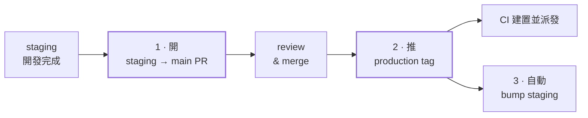
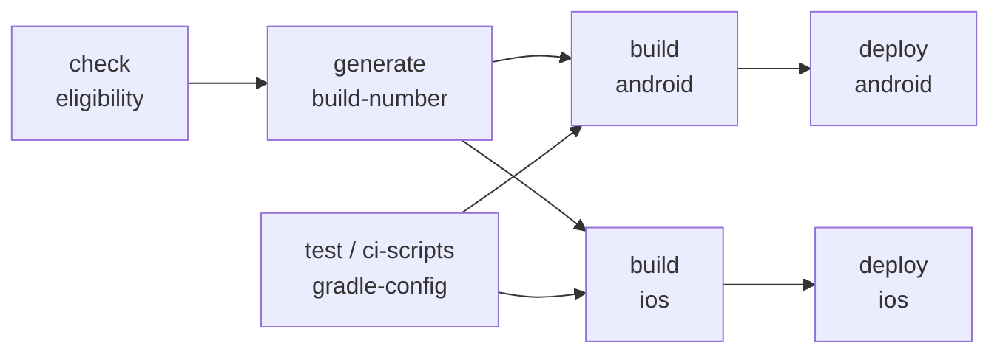

<!--
  這份是投影片的原稿。`python3 build/build.py flutter-cicd/index.md` 產生同目錄的
  index.html（投影片）與 index-script.md（逐字稿）。
  `>` 開頭的行是講者稿，會進逐字稿、不會出現在投影片上。
  格式說明看 build/build.py 的檔頭。
-->

## @cover

> 今天想跟大家講一次我們這套 Flutter App 的建置跟發版流程。
>
> 會想講這個是因為，這條流程平常運作得很安靜——你開 PR、merge、然後某天某個人點幾下，App 就出現在 TestFlight 上了。但只要出一次狀況，例如「建置綠燈可是沒發出去」、「QA 說版號對不上」，不知道裡面怎麼跑的就很難查。
>
> 今天分三段：**怎麼發版**、**版號怎麼決定**、**環境怎麼切**。中間隨時可以打斷我問問題。

## 兩條部署線
@ Overview

整套流程的每個分歧，最後都能還原成一個問題：這是 staging 還是 main。分支決定環境，環境決定 bundle id、Firebase 專案與後端網域。

::: compare
::: pane dev | staging → development
tag :: dev1.4.2
bundle id :: com.example.myapp<span class="dev-t">.dev</span>
firebase :: staging 專案
產物 :: APK + IPA
派發 :: App Distribution / TestFlight
:::
::: pane prod | main → production
tag :: v1.4.2
bundle id :: com.example.myapp
firebase :: prod 專案
產物 :: APK + AAB + IPA
派發 :: App Distribution / TestFlight
:::
:::

兩條線各自獨立走完建置到派發，唯一的差別是 production 會多建一個 AAB。**沒有第三種組合**，後面所有機制都建立在這個限制上。

> 先給一張全景圖。
>
> 整套流程看起來分支很多，但每一個分歧，最後都能還原成同一個問題：**這是 staging 還是 main**。
>
> **如果今天只記得一件事，就記這張。** 後面所有東西都是這張圖的細節。

# 發版

要按哪幾個按鈕、誰在擋錯誤的發版、跑起來會經過哪些 job，以及那些 YAML 為什麼長那樣。

## 發版只要點幾次滑鼠
@ 發版 / 主線

全部在 GitHub Actions 介面上跑，不需要在本機下 `git tag`。第三步是自動發生的。



> 實際操作其實很簡單，**全部在 GitHub Actions 的介面上點**。
>
> 第一步，開一個 staging 到 main 的 PR，這是點 workflow 幫你開的。第二步，PR merge 之後跑「Push Production Tag」那支，它會算好 tag 名稱、推上去，CI 就開始建置跟派發。
>
> 第三步是自動發生的：推完 tag 之後，staging 那邊會自動 bump 到下一個版號。
>
> 所以正常發版的動作只有兩個：**開 PR、推 tag**。

## 四支手動 workflow，各管一件事
@ 發版 / workflow 對照

| Actions 介面上的名字 | 跑在 | 做什麼 |
|---|---|---|
| {m} Release Dev: Push Dev Tag to Deploy | {m dev-t nw} staging | 讀 pubspec 版號，建 `dev1.4.2` 並 push，觸發 dev 建置與派發 |
| {m} Release Production: 1. Open Staging → Main PR | {m dev-t nw} staging | 開一個 `Release 1.4.2` 的 staging → main PR |
| {m} Release Production: 2. Push Production Tag to Deploy | {m prod-t nw} main | 建 `v1.4.2` 並 push，觸發 production 建置與派發 |
| {m} Release Production: Bump Main For Hotfix | {m prod-t nw} main | hotfix 前先把 main 版號 PATCH +1，開 PR |

跑錯分支會直接失敗：每支第一步都檢查 `github.ref_name`，不符就 `exit 1`。

> 在 Actions 介面上會看到四支要手動觸發的 workflow，名字有點長，但規則很一致。
>
> `Release Dev` 那支是給 staging 用的。Production 那三支：第一支開 staging → main 的 PR，第二支推 production tag，第三支是 hotfix 之前先把 main 的版號往上推。
>
> 要注意的是**每一支都綁定分支**。所以不用怕在 main 上不小心點到 dev 那支——它會自己擋掉。

## 只有 tag 會派發，而且 tag 與分支必須配對
@ 發版 / 派發閘門

推分支、開 PR、手動觸發都只跑測試與建置。`check-deployment-eligibility` 是唯一的開關，它看兩個條件。

::: compare
::: pane neutral | 條件一 / tag 格式對
<span class="dev-t">dev</span> 線 :: ^dev[0-9]+\.[0-9]+\.[0-9]+(-[0-9]+)?$
<span class="prod-t">prod</span> 線 :: ^v[0-9]+\.[0-9]+\.[0-9]+(-[0-9]+)?$
:::
::: pane neutral | 條件二 / tag 真的在那條線上
用 `git merge-base --is-ancestor` 確認 tag 指向的 commit 是 `origin/staging`（或 `origin/main`）的祖先。

在 main 推 `dev1.4.2`、或在 staging 推 `v1.4.2`，會建置成功但**跳過派發**。
:::
:::

```yaml
# 兩個條件都成立才輸出 should_deploy=true，兩個 deploy job 都掛這個條件
if: needs.check-deployment-eligibility.outputs.should_deploy == 'true'
```

被跳過派發時會掛一條 `::warning::` 說明原因，不會只留一個容易誤讀成「已部署」的灰色 skipped。

> 這頁回答一個很常見的疑問：為什麼我推了東西，CI 綠了，但 App 沒更新。
>
> 因為**只有 tag 會派發**。推分支、開 PR、手動觸發，這些都只跑測試跟建置。
>
> 第一，tag 的格式對不對，正規表達式卡得滿死的。第二，**這個 tag 真的長在那條線上**。所以你在 main 上推一個 `dev1.4.2`，建置會成功，但會跳過派發。
>
> 另外被跳過派發的時候，run summary 上會掛一條 warning 說明原因，不會只留一個灰色的 skipped——那個太容易被誤讀成「已經發出去了」。

## 同版本再發一次，後綴從 -2 開始
@ 發版 / 重發

送審被打回、上傳到一半掛掉，都要同版本再發一次。這時候**版本號不該動**——動了會讓使用者看到一個不存在的版本。

```
v1.4.2      第一次發
v1.4.2«-2»    同一個版本，第二次發
v1.4.2«-3»    第三次
```

tag regex 從一開始就把 `(-[0-9]+)?` 算進去，所以重發的 tag 一樣通過派發閘門。**後綴數字對齊「第 N 次」的口語，所以沒有 -1**。版號不變，但 build number 會遞增，TestFlight 與 App Distribution 都視為新的建置。

> 有時候同一個版本要發兩次，例如送審被打回來。
>
> 這時候 workflow 會先列出遠端所有符合的 tag，算出這是第幾次發版，再決定 tag 名。第一次是純版號，第二次 `-2`，第三次 `-3`。
>
> **後綴數字對齊「第 N 次」的口語，所以沒有 -1**，這點常有人問。
>
> dev 線直接重跑就好；prod 線會擋下來要你勾一個確認——那道摩擦是刻意的，它要你先想清楚，如果這其實該是一個新版本，那就該 bump 而不是重發。

## 兩條 CI 線的 workflow 長這樣
@ 發版 / 兩份檔案
@tight: 1

觸發條件的差別只有三個地方。底下十個 job 的兩百多行，兩條線幾乎逐字相同。

::: compare
::: pane dev | ci-development.yml
```yaml xs
name: "CI: Development"
on:
  push:
    branches: [«staging»]
    tags: ["«dev»[0-9]*.[0-9]*.[0-9]*"]
  pull_request:
    branches: [«staging»]
concurrency:
  cancel-in-progress: «true»
jobs:
  test: ...
  ci-scripts: ...
  gradle-config: ...
  resolve-version: ...
  check-deployment-eligibility: ...
  generate-build-number: ...
  build-android: ...
  build-ios: ...
  deploy-firebase: ...
  deploy-testflight: ...
```
:::
::: pane prod | ci-production.yml
```yaml xs
name: "CI: Production"
on:
  push:
    branches: [«main»]
    tags: ["«v»[0-9]*.[0-9]*.[0-9]*"]
  pull_request:
    branches: [«main»]
concurrency:
  cancel-in-progress: «false»
jobs:
  test: ...
  ci-scripts: ...
  gradle-config: ...
  resolve-version: ...
  check-deployment-eligibility: ...
  generate-build-number: ...
  build-android: ...
  build-ios: ...
  deploy-firebase: ...
  deploy-testflight: ...
```
:::
:::

> 先看這兩份檔案本身。
>
> 上半段是觸發條件，差別只有三個地方：監聽哪個分支、tag 的 glob 長怎樣、還有 production 線刻意不中斷正在跑的建置——它 `cancel-in-progress` 是 false，因為一次正式發版跑到一半被新的 push 砍掉，比多跑一次還糟。
>
> 下半段是十個 job，兩條線的名字跟順序完全一樣。**每個 job 底下我都用三個點省略掉了，那才是重點：那些點加起來是兩百多行**，checkout、裝 Flutter、拉 submodule、簽章、上傳，兩邊幾乎一模一樣。
>
> 下一頁先看這十個 job 跑起來的樣子，再回來講那兩百行怎麼處理。

## 一次建置跑過的 job
@ 發版 / 流程
@tight: 1

上一頁那十個 job 跑起來是這樣。兩條線的結構一樣，只有環境參數不同。



- `test`、`ci-scripts`、`gradle-config`、`resolve-version`、`check-deployment-eligibility` **五個平行起跑**
- `generate-build-number` 要等閘門結果，才知道這次算不算正式建置；之後 Android 與 iOS 平行建置、各自派發
- `gradle-config` **不被任何 job `needs`**：它不擋別人，但自己紅了整條 run 就是紅的

> 這是一次建置實際會跑到的 job。
>
> 最上面五個是平行起跑的。`ci-scripts` 跑的是 CI 自己那些 shell script 的測試，三十幾秒就完。
>
> `generate-build-number` 要等閘門的結果，因為它得先知道這次算不算正式建置，才知道要不要動計數器。
>
> 再來 Android 跟 iOS 平行建置，最後才是派發那一層——**只有 tag 會走到最下面那格**。
>
> 回到剛剛那個問題：這十個 job、兩百多行，兩條線幾乎一模一樣。如果真的複製兩份，改一個步驟就要記得改兩次，而「記得」這件事遲早會失敗。

## 重複的步驟都抽成 composite action
@ 發版 / 重複的處理
@tight: 1

兩條線共用同一組 action，環境差異只用 `inputs` 表達，所以流程只有一份。

| .github/actions/ | 被誰用 | 關鍵 inputs |
|---|---|---|
| {m} setup-submodules | test / gradle-config / build-android / build-ios | {m} deploy-key |
| {m} cleanup-ssh | 同上，收尾用 | {m} — |
| {m} build-number | 兩條 CI 線 | {m} environment, persist |
| {m} build-android | 兩條 CI 線 | {m} environment, build_aab, 簽章 |
| {m} build-ios | 兩條 CI 線 | {m} environment, 簽章, dSYM |
| {m} deploy-firebase | 兩條 CI 線 | {m} environment, artifact_name |
| {m} deploy-testflight | 兩條 CI 線 | {m} environment, artifact_name |

::: note 抽出來還有一個不是為了 DRY 的理由
Actions 頁面左邊那排會列出 repo 裡**所有的 workflow**。這些步驟本來各自是一支 workflow，那排長到要找「我要點哪一支發版」都得先掃一遍。放進 `.github/actions/` 之後它們不再出現在那排，**左邊只剩下真的需要人去點的那幾支**。
:::

> 有人可能會問：兩條 CI 線是不是兩份幾乎一樣的 YAML，改一邊忘記另一邊怎麼辦。
>
> 答案是重複的步驟都抽成 composite action 了。兩條線共用同一組 action，**環境差異只用 inputs 表達**。像 `build-android` 收 `environment` 跟 `build_aab`，dev 線傳 false、prod 線傳 true，就這樣而已。
>
> 但我想講的其實是下面那個框：**抽出來還有一個不是為了 DRY 的理由。**
>
> 這些步驟本來各自是一支 workflow，而 Actions 頁面左邊那排會把所有 workflow 列出來。那排長到你要找「發版要點哪一支」都得先掃一遍。放進 `.github/actions/` 之後它們就不出現在那排了——左邊只剩下真的需要人去點的那幾支。
>
> 這是個很小的事，但它每天都在影響你用這個頁面的體驗。

## PR 上那些機器人是誰
@ 發版 / 身分

自動開的 PR 與 commit 都掛在 `github-actions[bot]` 名下。要讓 commit 正確歸戶，email 必須用那個 bot 帳號的 user id 加 GitHub 的 noreply 格式。

```yaml sm
- name: Configure Git
  run: |
    git config user.name  "github-actions[bot]"
    git config user.email "«41898282»+github-actions[bot]@users.noreply.github.com"

# 用 create-pull-request 的話，改成直接指定 committer / author
- uses: peter-evans/create-pull-request@v8
  with:
    token: ${{ secrets.«GITHUB_TOKEN» }}
    committer: github-actions[bot] <41898282+github-actions[bot]@users.noreply.github.com>
    author:    github-actions[bot] <41898282+github-actions[bot]@users.noreply.github.com>
```

`41898282` 是 `github-actions[bot]` 這個帳號的 user id，寫錯或省略的話 commit 會變成無主的、頭像是灰的。這幾支用預設的 `GITHUB_TOKEN` 就夠——它們只要開 PR 給人看。

> 你在 PR 列表上會看到兩種非人類的操作者。
>
> 一種是 `github-actions[bot]`，自動開 PR 的都是它。重點是那個 email：**數字是這個 bot 帳號的 user id**，加上 GitHub 的 noreply 網域，commit 才會正確歸到 bot 身上。寫錯的話 commit 會變成無主的，頭像是灰色的問號。
>
> 兩種寫法都列在上面：自己 `git config` 的話寫那兩行；用 `create-pull-request` 這個 action 的話，直接把 committer 跟 author 指定成同一串。
>
> 另外注意 token：這幾支用預設的 `GITHUB_TOKEN` 就夠，因為它們只要開 PR 給人看。下一頁講為什麼推 tag 不能用它。

## 為什麼推 tag 需要 App token
@ 發版 / token

GitHub 有一條防遞迴的規則：**用內建 `GITHUB_TOKEN` 推上去的 ref，不會觸發任何 workflow**。所以用預設 token 推 tag，tag 會成功推上去、但 CI 完全不動，而且沒有任何錯誤訊息。

::: compare
::: pane prod | 推 tag 的兩支
用 GitHub App 簽出 installation token，有效一小時、job 結束自動撤銷。

在 tag 列表上看得出「這是 release 流程推的」，不是某個人手推的。
:::
::: pane dev | 其餘（bump / sync / 開 PR）
預設 `GITHUB_TOKEN` 就夠。

副作用剛好合理：**自動開的 PR 不會自己跑 CI**，等人 merge 才跑。
:::
:::

為什麼不用個人 PAT：綁人、會過期、人離職就壞掉，而且在 PR 上看起來像是那個人做的。

> 這是一個踩過才會知道的地雷。
>
> GitHub 有一條防遞迴的規則：**用內建的 `GITHUB_TOKEN` 推上去的 ref，不會觸發任何 workflow**。所以如果用預設 token 推 tag，tag 會成功推上去，但 CI 完全不動，發版就斷在那裡，而且不會有任何錯誤訊息。
>
> 解法是用 GitHub App 簽一個 installation token。為什麼不用個人 PAT？因為 PAT 綁人、會過期、人離職就壞掉。
>
> 另外權限是收緊的：兩支 CI workflow 預設 `contents: read`，只有計數那個 job 提升成 write，避免其他 job 把一個可寫的 token 留在 `.git/config` 裡。

# 版本

兩個數字：一個給人看的版號，一個給商店看的 build number。誰決定它們、在哪個 CI 步驟被算出來。

## 版號：人決定前兩碼，CI 只動 patch
@ 版本 / 版號

版號的唯一來源是 `pubspec.yaml` 的 `version:`，CI 對它**不做任何轉換**——dev 與 prod 讀的是同一個欄位，差別只在 tag 前綴。

```yaml
# pubspec.yaml
version: «MAJOR».«MINOR».«PATCH»+«BUILD»      # 例：1.4.2+1
```

| 這個數字 | 誰決定 | 怎麼產生 |
|---|---|---|
| {m} MAJOR . MINOR | {nw} 人 | {nw} 破壞性改動或加了功能，自己改 `pubspec.yaml` |
| {m} PATCH | {nw} CI | {nw} 三支 bump workflow 各自 +1，**只開 PR、不直接 push** |
| {m} tag `v1.4.2` | {nw} CI | {nw} 從版號推導，由 push tag 那支 workflow 建出來 |
| {m} BUILD | {nw} CI | {nw} `generate-build-number` job 的產物，下一頁講 |

`resolve-version` 這個 job 做的就是把 `pubspec.yaml` 的 `version:` 讀出來，後面每一步用的都是它。

> 版號的唯一來源是 `pubspec.yaml`。這件事很重要：**CI 對版號不做任何轉換**，dev 跟 prod 讀的是同一個欄位。
>
> 三碼分別是 MAJOR、MINOR、PATCH，加號後面那個是 build number。要記住的是**分工**：MAJOR 跟 MINOR 是人決定的，你要自己去改 `pubspec.yaml`；**CI 只會動 PATCH**，而且只在 bump 的時候 +1，也只開 PR、不直接 push 到保護分支。
>
> 這張表是這一章的地圖，四個數字誰產生的一目了然。等一下講 build number 的時候會回到最後一列。

## build number：年月加當月流水號，九位數
@ 版本 / build number

build number 只有一個硬性要求：**單調遞增**。這是 `generate-build-number` job 的產物。

```
«260700015»   =   «26» 年後兩碼   ·   «07» 月份   ·   «00015» 當月第幾次，五位
```

| 什麼情況 | 號碼從哪來 | 會不會動計數器 |
|---|---|---|
| {nw} 推 `dev*` / `v*` tag（真的要發版） | {nw} build-metadata 分支上的月計數器 | {nw} **會**，+1 並寫回 |
| {nw} PR、推分支、手動觸發 | {m nw} `GITHUB_RUN_NUMBER` 取五位 | {nw} **不會**，完全不碰 |

- 年月放前面可以保證跨月跨年都遞增（`2701` 一定大於 `2612`），而流水號每月歸零、每個環境各自計數，數字不會無限長大
- 九位數的上限是 `991299999`，Android `versionCode` 的上限是 21 億——**可以用到 2099 年**
- PR 那條不消耗計數器，所以**計數器上的數字等於真正發出去的次數**

> build number 只有一個硬性要求：單調遞增。剩下都是設計空間。
>
> 我們的格式是九位數：年後兩碼、月份、當月流水號。為什麼這樣切？看到號碼就知道大概什麼時候建的，查 log 省一次來回；而且計數器每個月歸零，數字不會無限長大。
>
> 為什麼是九位？Android 的 `versionCode` 上限是 21 億，九位數最大 `991299999`，可以用到 2099 年。
>
> 下面那張表是重點：**只有真的要發版才動計數器**。PR 驗證跑幾百次都不會影響它，所以計數器上的數字就等於真正發出去的次數。

## 兩種號碼來源長什麼樣
@ 版本 / 狀態放哪

「每個月第幾次」是必須跨 build 保存的狀態，而 CI 是無狀態的。我們把它存在 repo 自己身上：一個叫 `build-metadata` 的孤兒分支，裡面沒有任何程式碼，只有一個 JSON。

```json
// build-metadata 分支上唯一的檔案：build-history.json
{
  "development": { "2026-06": 42, "2026-07": «15» },
  "production":  { "2026-06":  3, "2026-07":  «2» }
}
```

- 每次遞增就 append 一個 commit，不 amend、不 force——**那條歷史本身就是 build number 的發放紀錄**，想查哪個號碼什麼時候發的直接 `git log`
- PR 那條走 `GITHUB_RUN_NUMBER`，那是 GitHub 給每個 run 的流水號，取五位就好，**完全不碰這個分支**
- 為什麼不用 Actions cache 或 artifact 存狀態：兩者都會過期，而版號的狀態不能過期

> 「每個月第幾次」是一個必須跨 build 保存的狀態。CI 是無狀態的，所以這個數字得存在某個地方。
>
> 我們存在 repo 自己身上：一個孤兒分支，跟主線程式碼完全隔離，裡面只有這個 JSON。上面那個 `15` 就是 development 環境在 2026 年 7 月已經發了 15 次。
>
> 每次遞增就 append 一個 commit，不 amend 也不 force，所以那條歷史本身就是發放紀錄。
>
> PR 那條就簡單了，直接拿 GitHub 給每個 run 的流水號取五位，不碰這個分支。
>
> 有人可能會問為什麼不用 Actions 的 cache 或 artifact——因為兩者都會過期，而版號的狀態不能過期。

# 環境

一份設定檔怎麼一路長成 bundle id、app 名稱、icon、Firebase 專案與派發目標。

## 環境設定就是這一份 JSON
@ 環境 / 單一入口
@tight: 1

一個環境一份，`build_config/` 底下。上半是**值**，下半是**路徑**——這個環境的檔案在哪，由設定檔自己講，程式裡不出現 `dev`、`prod` 這種字面值。

```json xs
// build_config/development.json（production.json 是同樣的欄位、不同的值）
{
  "ENV": "development",
  "API_BASE_URL": "https://api-dev.example.com",
  "ASSETS_URL":   "https://assets-dev.example.com",
  "LOG_LEVEL": "debug",
  "ENABLE_DEVELOPER_LOGGER": true,

  "«APP_CONFIG_SUFFIX»": ".dev",
  "«APP_CONFIG_NAME»": "MyApp [DEV]",
  "«APP_CONFIG_ICON_NAME»": "AppIcon-Dev",
  "«APP_CONFIG_LAUNCH_IMAGE»": "LaunchImage-Dev",
  "NOTIFICATION_CHANNEL_ID": "default_notification_channel",

  "«ANDROID_FIREBASE_CONFIG_PATH»": "android/app/config/dev/google-services.json",
  "«ANDROID_RES_DIR»": "android/app/src/dev/res",
  "«IOS_FIREBASE_CONFIG_PATH»": "ios/config/Dev/GoogleService-Info.plist"
}
```

建置前會先跑一支 script 把它加工成 `dart-define.json`：合併 `.local` 覆寫、檢查必填欄位、抽出 Google 登入的 client ID。那份產物與 `*.local.json` 都在 `.gitignore` 裡——**它們是產物不是設定**。

> 這一章的地基就是這份檔案，所以我直接把它印出來。
>
> 一個環境一份，放在 `build_config/` 底下。看它的結構：上半段是**值**——app 名稱、icon 名稱、bundle id 後綴；下半段是**路徑**——這個環境的 Firebase 設定在哪、Android 的資源目錄在哪。
>
> 標起來的那幾個欄位是等一下會一直出現的，先有印象就好。
>
> 重點是下半段：**路徑是設定檔自己講的，不是程式從環境名稱推導的**。所以加一個環境不用改任何程式碼，放一份 JSON、把它指到的目錄建出來就好。
>
> 建置前會先跑一支 script 把它加工成 `dart-define.json`：合併你的 `.local` 覆寫、檢查必填欄位有沒有漏、抽出 Google 登入要用的 client ID。那份產物在 `.gitignore` 裡，不要 commit。

## dev 跟正式版要能裝在同一台手機上
@ 環境 / bundle id

所以兩個環境的 bundle id 必須不同。做法不是各寫死一整串，而是**一個 base，一個由環境決定的後綴**。

<div class="idshow">
  <div class="idline small"><span class="idbase">com.example.myapp</span><span class="idsuf dev" data-note="development">.dev</span></div>
  <div class="idline small"><span class="idbase">com.example.myapp</span><span class="idsuf prod" data-note="production：空字串">&nbsp;&nbsp;&nbsp;</span></div>
</div>

對系統來說這是兩個不同的 app，可以同時安裝、各自有自己的資料。後綴就是上一頁那個 `APP_CONFIG_SUFFIX`，兩個平台共用同一個名字——但它們拿到這個值的路徑不一樣，接下來兩頁分別講。

> 為什麼 bundle id 要分？很單純：**因為 dev 版跟正式版要能同時裝在同一台手機上。**
>
> 對作業系統來說，bundle id 就是 app 的身分證。兩個 app 的 bundle id 一樣，後裝的就會蓋掉先裝的。所以測試版必須有一個不同的 id。
>
> 做法不是各寫死一整串，而是一個 base 加一個後綴。development 是 `.dev`，production 是空字串。
>
> 後綴就是上一頁那個 `APP_CONFIG_SUFFIX`。兩個平台用同一個名字，但拿到它的路徑完全不同——接下來兩頁分開講。

## Android 怎麼拿到這些值
@ 環境 / Android

Gradle 解得開 dart-define，所以 Android 這條路最短：**所有 key 一律進同一個 map**，取值再經過一層檢查。

```kotlin sm
// ① 解 base64，全部進 map。這裡不認識任何環境名稱
dartDefines.split(",").forEach { entry ->
  val pair = decode(entry).split("=", limit = 2)
  dartEnvironmentVariables[pair[0]] = pair[1]
}

// ② 取值一律經過 environmentValue()，不直接讀 map
applicationId       = "com.example.myapp"
«applicationIdSuffix» = environmentValue("APP_CONFIG_SUFFIX", allowBlank = true)

// ③ 資源目錄不用複製，直接疊進來
sourceSets["main"].res.srcDirs(environmentPath("ANDROID_RES_DIR"))
```

第 ② 行為什麼不直接讀 map：直接讀就會寫出 `?: "myapp"` 這種行內預設值，**那會把「設定檔漏了一個 key」變成一個看起來很正常的 app 名稱**，出貨之後才發現。同一組變數也決定 app 名稱與通知頻道文字。

> Android 這條路最短，因為 Gradle 解得開 dart-define 的內容。
>
> 第一段：解 base64，所有 key 一律進同一個 map。這裡完全不認識環境名稱——不會有 `if (isDevelopment())` 這種東西。
>
> 第二段是 bundle id：base 是寫死的，後綴走設定檔。注意取值是經過 `environmentValue()` 這個函式的，不直接讀 map。**為什麼？** 因為直接讀就會寫出 `?: "myapp"` 這種行內預設值，那會把「設定檔漏了一個 key」變成一個看起來很正常的 app 名稱，要出貨之後才發現。包一層就可以在缺值的當下直接炸掉。
>
> 第三段是資源目錄。Android 這邊很好，Gradle 支援多來源目錄，把環境的 res 疊進去就好，不用複製任何東西。

## iOS 怎麼拿到這些值
@ 環境 / iOS
@tight: 1

Xcode 讀不到 dart-define，所以要多一支 script 把值翻譯成 xcconfig。關鍵是**那份產出的檔案是怎麼被 build 讀到的**。

1. 值在 `build_config/development.json`
2. `generate_app_config.sh` 讀它，寫出 `ios/Flutter/AppConfig.xcconfig`——**產物，在 `.gitignore` 裡**
3. `Debug.xcconfig` 與 `Release.xcconfig` 各自 `#include` 它，而 Xcode 專案設定指到這兩份

```bash sm
# Debug.xcconfig 與 Release.xcconfig 內容一樣，都是兩行
#include "Generated.xcconfig"     # Flutter 自己產的
#include "«AppConfig.xcconfig»"     # 這條就是我們的值接進 build 的地方

# pbxproj 裡寫的是變數，不是值
PRODUCT_BUNDLE_IDENTIFIER = "com.example.myapp«$(APP_CONFIG_SUFFIX)»"
```

因為 Debug 與 Release 都 include 同一份，**本機 debug run 跟 CI release build 走的是同一組值**。

> iOS 這條路多一站，因為 Xcode 讀不到 dart-define。
>
> 那支 script 把設定檔的值寫成一份 xcconfig。但我上次講的時候發現大家最不清楚的其實是：**那份產出的檔案，到底是怎麼被 build 讀到的？**
>
> 就是上面那三步。反過來從 Xcode 那頭看更清楚：Xcode 的專案設定指到 `Debug.xcconfig` 跟 `Release.xcconfig`，這兩份各自只有兩行 `#include`，其中一行 include 的就是 script 產出來的 `AppConfig.xcconfig`。
>
> 所以鏈是這樣：**設定檔 → script → AppConfig.xcconfig → 被 Debug/Release include → Xcode 讀到**。中間任何一環沒跑，Xcode 讀到的就是上一次的值。
>
> 還有一點：因為 Debug 跟 Release include 的是同一份，所以你本機 run 跟 CI 建置走的是同一組值，不會有「本機看起來對、CI 卻不對」這種事。

## 有些東西沒有變數可用，只能把檔案複製到位
@ 環境 / 檔案就位

變數能解決的就用變數。剩下三個場合只能在建置前把檔案複製成**固定的檔名**，讓下游工具讀得到——因為那些工具寫死了要讀哪個路徑的哪個檔名，不吃任何變數。

| 要換的東西 | 誰做 | 來源由哪個欄位指定 → 複製到哪 |
|---|---|---|
| Android Firebase 設定 | {m} Gradle task<br>`copyGoogleServices` | {m} ANDROID_FIREBASE_CONFIG_PATH<br>→ app/google-services.json |
| iOS Firebase 設定 | {m} shell script<br>`generate_app_config.sh` | {m} IOS_FIREBASE_CONFIG_PATH<br>→ ios/Runner/GoogleService-Info.plist |
| iOS Launch image | {m} Xcode build phase<br>`copy_launch_image.sh` | {m} APP_CONFIG_LAUNCH_IMAGE（經 xcconfig）<br>→ Assets.xcassets/LaunchImage.imageset |
| Android app icon 與資源 | {m} **不用複製**<br>Gradle `sourceSets` | {m} ANDROID_RES_DIR<br>→ 直接疊進 res.srcDirs |

前三個的**目標**檔案都在 `.gitignore` 裡——它們是建置產物，不是設定。最後一列是唯一不需要複製的，因為 Gradle 支援多來源目錄；iOS 沒有等價機制。

> 變數能解決的都解決完了，剩下的只能用複製的。
>
> 為什麼？因為 Firebase 的 SDK、Xcode 的 storyboard 這些下游工具，**寫死了要讀哪一個路徑的哪一個檔名**，不吃任何變數。所以只能在它們讀之前，把對的那一份複製成那個名字。
>
> 表上四列，前三列要複製，最後一列不用——Android 的圖示跟資源可以直接疊目錄，就是上上頁講的 `sourceSets`。iOS 沒有等價的機制。
>
> 還有一個容易忘的：前三個的**目標**檔案都要進 `.gitignore`。它們是建置產物。忘了的話就會有人 commit 一份 dev 的 `google-services.json` 上去。

## Android：一個 Gradle task，掛在 plugin 前面
@ 環境 / Android 的複製

```kotlin sm
// 路徑在 configuration 階段就取好：doLast 裡碰 project 或 file() 會讓這個
// task 與 configuration cache 不相容
tasks.register("copyGoogleServices") {
  val sourceFile = «environmentPath»("ANDROID_FIREBASE_CONFIG_PATH")
  val targetFile = file("google-services.json")
  doLast {
    if (sourceFile.exists()) sourceFile.copyTo(targetFile, overwrite = true)
    else throw GradleException(   // 找不到就炸，而且指名是哪個欄位指錯
      "google-services.json not found: $sourceFile (ANDROID_FIREBASE_CONFIG_PATH)")
  }
}

tasks.whenTaskAdded {   // 掛在 Google Services plugin 前面，確保它讀到複製後的檔案
  if (name == "processDebugGoogleServices" || name == "processReleaseGoogleServices")
    dependsOn("copyGoogleServices")
}
```

錯誤訊息要**指名是哪個欄位指錯了**。只說「檔案不存在」，下一個人得先翻 gradle 找出誰在讀它。

> 這是 Android 那段複製的完整寫法，一個自己註冊的 task。
>
> 有一個細節不能省：**所有路徑都在 configuration 階段解析完**，`doLast` 裡只用已經取好的值。在 `doLast` 裡碰 `project` 或 `file()` 會讓這個 task 跟 configuration cache 不相容。
>
> 找不到檔案就 throw，不會靜默跳過。而且錯誤訊息把是哪個欄位指錯了一起寫出來——這是寫的時候多花一分鐘的事，但省下的是別人二十分鐘。
>
> 最後用 `whenTaskAdded` 掛在 Google Services plugin 前面，確保 plugin 讀到的是複製後的檔案。

## iOS：一行 cp，加一個掛在 Xcode 上的 build phase
@ 環境 / iOS 的複製

這兩段複製發生在**不同時機**：Firebase 設定跟著產 xcconfig 的 script 一起跑，啟動圖則是 Xcode 每次 build 都跑。

```bash sm
# ① generate_app_config.sh 裡面，跟 xcconfig 一起產。不存在就 exit 1
src="$PROJECT_ROOT/$IOS_FIREBASE_CONFIG_PATH"
[ -f "$src" ] || { echo "error: not found: $src（來自 $CONFIG_FILE）" >&2; exit 1; }
cp "$src" "$PROJECT_ROOT/ios/Runner/GoogleService-Info.plist"
```

```bash sm
# ② copy_launch_image.sh 掛成 Xcode 的 Run Script build phase，每次 build 都跑
ASSETS_DIR="${SRCROOT}/Runner/Assets.xcassets"
SOURCE="${ASSETS_DIR}/${«APP_CONFIG_LAUNCH_IMAGE»}.imageset"   # 讀 xcconfig 變數
rm -rf "$TARGET" && cp -R "$SOURCE" "${ASSETS_DIR}/LaunchImage.imageset"
```

::: note 啟動圖為什麼要多這一步
因為 `LaunchScreen.storyboard` **沒辦法引用 xcconfig 變數**，裡面只能寫死一個圖片名稱。所以讓它固定引用 `LaunchImage`，我們在 build 之前把對的那份複製成那個名字。
:::

> iOS 這兩段複製發生在不同時機，這點很容易搞混。
>
> Firebase 設定是跑 `generate_app_config.sh` 的時候複製的，跟上一頁那份 xcconfig 一起產。來源由設定檔指定，不存在就 `exit 1`。
>
> 啟動圖不一樣，它掛成 Xcode 的 Run Script build phase，**每次 build 都會跑**，讀 xcconfig 的變數決定來源。
>
> 為什麼啟動圖要多這一步？因為 storyboard 沒辦法引用 xcconfig 變數，裡面只能寫死一個圖片名稱。所以我們讓它固定引用 `LaunchImage`，在 build 之前把對的那份複製成那個名字。
>
> 順帶一提，這不是我們自己想的偏方——iOS 要依環境換 storyboard 裡的素材，社群的標準解就是 build phase script。

## 一支 script 決定 iOS 的四個值
@ 環境 / iOS 其餘變數

這四個值不是寫在 script 裡，而是從 `build_config/<env>.json` **逐欄位讀出來**——跟 Android 讀的是同一份檔案。

| xcconfig 變數 | {dev-h} development | {prod-h} production | 誰在用 |
|---|---|---|---|
| {m} APP_CONFIG_SUFFIX | {m} .dev | {m} （空字串） | {m} PRODUCT_BUNDLE_IDENTIFIER |
| {m} APP_CONFIG_NAME | {m} MyApp [DEV] | {m} MyApp | {m} CFBundleDisplayName |
| {m} APP_CONFIG_ICON_NAME | {m} AppIcon-Dev | {m} AppIcon-Prod | {m} ASSETCATALOG_COMPILER_APPICON_NAME |
| {m} APP_CONFIG_LAUNCH_IMAGE | {m} LaunchImage-Dev | {m} LaunchImage-Prod | {m} copy_launch_image.sh |

在 CI 裡它還會把算好的完整 bundle id 寫進 `GITHUB_ENV`，後面抓簽章憑證的步驟直接用那個值。

::: note 這是全場最需要記住的一件事
**iOS build 前忘記跑 `generate_app_config.sh`，不會有任何提示。** 它就沿用上一次的 `AppConfig.xcconfig`——你昨天跑 dev、今天想跑 prod，build 出來的還是 dev。這個到現在沒有擋。
:::

> 這四個值不是寫在 script 裡，而是從設定檔逐欄位讀出來的，跟 Android 讀的是同一份。
>
> 表格右邊那欄是「誰在用」——可以看到它們最後接到的都是 Xcode 認得的東西：bundle id、顯示名稱、icon 名稱，還有給前一頁那支複製 script 用的啟動圖名稱。
>
> 在 CI 裡它還會多做一件事：把算好的完整 bundle id 寫進 `GITHUB_ENV`，後面抓簽章憑證的步驟會直接用那個值。
>
> 最後那個框，是我今天最想要大家記住的一件事：**iOS build 之前忘記跑這支 script，不會有任何提示。** 它會安靜地沿用上一次的設定。昨天跑 dev、今天想跑 prod，build 出來的還是 dev，而且完全沒有警告。
>
> 這個目前沒有擋起來。所以請大家先記住這個操作習慣。

## 用 environment 隔離同名的 variable 與 secret
@ 環境 / GitHub 設定

建置的差異來自 repo 裡的檔案，**派發的差異來自 GitHub 的設定**。兩條線的 deploy job 寫得一模一樣，只差 `environment:` 那一行。

```yaml sm
# 兩條線的 deploy job 逐字相同，只差 environment 那一行
deploy-firebase:
  environment: «development»      # ci-production.yml 寫的是 «production»
  steps:
    - uses: ./.github/actions/deploy-firebase
      with:
        firebase_android_app_id:      ${{ vars.«FIREBASE_ANDROID_APP_ID» }}
        firebase_distribution_groups: ${{ vars.«FIREBASE_DISTRIBUTION_GROUPS» }}
```

在 GitHub 的 **Settings → Environments** 底下，`development` 與 `production` 各自有一組**同名**的 variable 與 secret，值不同。workflow 只寫名字、不寫值，GitHub 依 job 上那行 `environment:` 決定給哪一份。

- 好處是：要換測試群組、換 Firebase app，改 GitHub 設定就好，**不用動 repo 也不用重新 review**
- build job **刻意不掛 `environment:`**——掛了會被 environment 的 branch policy 連 PR build 一起擋掉

> 前面講的都是建置的差異，來源是 repo 裡的檔案。**派發的差異來源不一樣，是 GitHub 的設定。**
>
> 上次講這頁我列了一大堆變數名稱，其實方向錯了。要講的其實只有一件事：**同一個變數名，不同 environment 給不同的值。**
>
> 看上面那段：兩條線的 deploy job 幾乎逐字相同，連變數名都一樣，**只有 `environment:` 那一行不同**。
>
> 值在哪？在 GitHub 的 Settings → Environments 底下。development 跟 production 各自有一組同名的 variable 跟 secret，值不一樣。workflow 只寫名字，GitHub 依那行 `environment:` 決定要給哪一份。
>
> 這樣的好處是：要換測試群組、換 Firebase app，改 GitHub 設定就好，不用動 repo、不用開 PR、不用重新 review。
>
> 最後一點是一個坑：**build job 是刻意不掛 `environment:` 的**。掛了的話，environment 的 branch policy 會連 PR build 一起擋掉。

## 同一件事，Android 原生有現成機制：flavor
@ 環境 / 對照

`productFlavors` 就是為「同一份程式碼、多個變體」設計的，Flutter 也支援 `--flavor dev`。我們沒用它，但值得知道它能吃掉多少我們現在手寫的東西。

| 要換的東西 | {dev-h} 走 flavor | {prod-h} 我們現在 |
|---|---|---|
| bundle id 後綴 | flavor 直接宣告 | 設定檔 → dart-define → gradle |
| Firebase 設定 | {nw} 放 `src/<flavor>/`，plugin 自己挑 | {nw} 自己寫 copy task |
| icon 與資源 | {nw} `src/<flavor>/res`，Gradle 自動疊加 | {nw} 設定檔指定目錄後疊加 |
| 一次建多個環境 | {nw} 一行指令 | {nw} 做不到 |
| **漏設一個值** | {nw} **安靜地拿 defaultConfig** | {nw} **逐 key loud fail** |

**Android 這一側單獨看，flavor 確實比我們現在的做法乾淨。** 但最後一列是重點：flavor 沒有「值帶齊了沒」這個概念。

> 講到這裡，可能有人會想：Android 不是本來就有 flavor 嗎？
>
> 對，而且我要先說清楚：**Android 這一側單獨看，flavor 確實比我們現在的做法乾淨。** 前四列它幾乎全包。
>
> 但最後一列是重點：flavor 沒有「值帶齊了沒」這個概念。漏設一個值，它就是安靜地拿 `defaultConfig` 的值——正好是我們前面費力氣在擋的那種錯配。

## iOS 沒有 flavor，只有 scheme × configuration
@ 環境 / 對照

Xcode 根本沒有 flavor 這個概念。Flutter 的 `--flavor dev` 在 iOS 是去找一個**同名的 scheme**，而且要建立對應的 build configuration，各自 include 不同的 xcconfig。

::: compare
::: pane dev | 換得掉的
bundle id、顯示名稱、icon 可以由 configuration 指到不同的 xcconfig。

切環境的體驗確實變好：Xcode scheme 選單直接切，不用先跑 script。

但**值還是走 xcconfig 變數**，跟我們現在一模一樣。
:::
::: pane prod | 換不掉的（前提：單 target）
`GoogleService-Info.plist` 還是要 build phase script 依環境複製——這是社群通行做法，**不是官方文件給的路**。

官方教的是分多 target，或 runtime 用 `FirebaseOptions` 自己選。啟動圖同理。
:::
:::

代價是環境清單會散在 `project.pbxproj` 裡，那是 GUI 產生的檔案，**diff 幾乎沒辦法 review**。

> iOS 這邊就沒有這麼好的事了，因為 **Xcode 根本沒有「變體」這個概念**。
>
> 換得掉的部分：bundle id、顯示名稱、icon 這些可以由 configuration 指到不同的 xcconfig。切環境的體驗確實會變好。但注意，**值還是走 xcconfig 變數**，跟我們現在一模一樣。
>
> 換不掉的部分要先加一個前提：這講的是**單 target** 的情況。Firebase 設定檔還是要一個 build phase script 依環境複製，這是社群通行的做法——但誠實說，**官方文件給的其實不是這條**，官方教的是分多 target，或者 runtime 用 `FirebaseOptions` 自己選。所以是我們選了 script 這條，不是只有這條路。
>
> 另外一個代價是：走 scheme 的話，環境清單會散在 `project.pbxproj` 裡面，那是 GUI 產生的檔案，diff 幾乎沒辦法 review。

## 那為什麼這個專案沒走 flavor
@ 環境 / 取捨

| 比較項 | {dev-h} 我們現在 | {prod-h} 走 flavor |
|---|---|---|
| 值的來源 | {nw} 一份 JSON，Android／iOS／Dart 共用 | {nw} Android 在 gradle、iOS 在 pbxproj，<br>Dart 端還是要另外 dart-define |
| 新增環境 | {nw} 加一份 JSON 加目錄，不動程式碼 | {nw} Gradle 加 flavor、Xcode 加 scheme<br>與 configuration |
| 切換環境 | {nw} **要先跑 script，忘了會靜默沿用** | {nw} 每次明示，體驗較好 |
| 一次出多環境 | {nw} **做不到** | {nw} 一行指令 |
| 漏設定 | {nw} 逐 key loud fail | {nw} **靜默拿 defaultConfig** |
| CI 影響 | {nw} 現有 workflow 完全不用動 | {nw} build／簽章／上傳都要帶 flavor |

結論是：**不是 flavor 不好，是這個專案在 iOS 那側省不到。** iOS 無論如何都要 xcconfig 加 script，只有 Android 換成 flavor 會讓兩個平台的設定就此分家。

> 把兩邊放在一起比。中間那兩列我們是輸的：切換環境要先跑 script，而且忘了會靜默沿用；一次出多個環境的產物我們也做不到。
>
> 贏的是漏設定的處理，還有 CI 完全不用動。
>
> 所以我的結論是：**不是 flavor 不好，是這個專案在 iOS 那側省不到。** iOS 無論如何都要 xcconfig 加 script，只有 Android 換成 flavor 會讓兩個平台的設定就此分家。
>
> 先聲明一下，**這頁是取捨判斷，不是 repo 現況**——我們沒有試過 flavor 版本再回頭比較。真的要重來，值得的時機是「環境長到三個以上，而且需要同一次 CI 產出多個環境的產物」。

## 今天沒講的，都有對應的流程
@ 收尾 / 邊界

今天走的是**正常發版**那條線。下面這些情況各自有對應的 workflow，機制跟前面講的是同一套。

| 情況 | 大概怎麼走 |
|---|---|
| {nw} Hotfix | 先跑一支 workflow 把 main 版號 PATCH +1，開 `hotfix/<version>` 進 main，之後走一般 `v` tag |
| {nw} 推完 v tag 之後 | 兩支自動 workflow 依情況 bump staging 版號、或把 main 的內容同步回 staging |
| {nw} 同版本重發 | 前面講過的 `-2` 後綴，prod 線需要勾一個確認 |
| {nw} iOS 簽章 / 自架 runner | Codemagic CLI ＋ 臨時 keychain；runner 有互斥與清理要管 |

**反過來也成立**：動了 workflow、script 或環境設定，記得同步更新你們自己的流程文件，不然下一個人會照著舊文件操作。這幾頁提到的 script，去識別化過的樣本放在這份簡報旁邊的 `samples/`。

> 今天走的是正常發版那一條線，這頁把沒講到的補上，讓「沒提到」不等於「沒有」。
>
> 第一列 hotfix、第二列推完 tag 之後的自動同步，這兩個是真的會遇到的。我不打算現在展開，因為你不在那個情境裡聽了也記不住——**知道有這個東西就夠了**。
>
> 最後那句話是反過來的提醒：**動了 workflow、script 或環境設定，記得同步更新流程文件。** 不然下一個人會照著舊文件操作。

## 帶走這四件事
@ 收尾

1. **分支決定一切。** staging 走 `dev` tag 與 staging 專案，main 走 `v` tag 與 prod 專案，沒有第三種組合。
2. **只有 tag 會派發。** 推分支與手動觸發只做測試與建置，也不會動到 build number 計數器。
3. **版號只有一個來源，就是 `pubspec.yaml`。** MAJOR / MINOR 人自己改，CI 只動 PATCH；build number 完全是 CI 的產物。
4. **環境差異只有一個入口，就是 `build_config/<env>.json`；變數解決不了的，用 script 把檔案複製到位。** 加一個環境不用改程式碼。代價是 **iOS 建置前一定要先跑 `generate_app_config.sh`——忘記不會報錯，只會安靜地用上一次的環境。**

> 如果今天只帶走四件事：
>
> **第一，分支決定一切。** 這是開場那張圖。
>
> **第二，只有 tag 會派發。** 這回答了「為什麼我推了但沒發出去」。
>
> **第三，版號只有一個來源。** 而且分工要記得：MAJOR 跟 MINOR 是人的事，CI 只動 PATCH，build number 完全不歸人管。
>
> **第四，環境差異只有一個入口，變數解決不了的就用 script 把檔案複製到位。** 這是今天環境那一章的全部——一份 JSON 說值也說路徑，剩下沒有變數可用的東西，用 script 在建置前把它們搬到位。
>
> 而它的代價就在同一句話裡：**iOS 建置前一定要先跑 `generate_app_config.sh`。** 忘記不會報錯，只會安靜地用上一次的環境。這是今天唯一一個我要你們改變操作習慣的地方。

## @thanks

> 以上，謝謝大家。有什麼問題嗎？
>
> ---
>
> ### 可能被問到的問題
>
> **Q：為什麼不用 flavor？** 見 flavor 那三頁。一句話：Android 那側 flavor 確實比較乾淨，但 iOS 沒有等價機制、還是要 xcconfig 加 script，只換 Android 會讓兩個平台的設定分家。
>
> **Q：我可以自己推 tag 嗎？** 技術上可以用 tag ruleset 擋，但更重要的是手推的 tag 不會帶 App 身分，也繞過了 workflow 的版號計算。請走 Actions 介面。
>
> **Q：build number 會不會用完？** 九位數最大 `991299999`，Android 上限 21 億，可以用到 2099 年。
>
> **Q：為什麼我的 PR CI 綠了，發版卻炸掉？** 最常見的是 deploy-only 的路徑 PR 根本不會跑到。這也是為什麼加了 `gradle-config` 這個 job——把「另一個環境的設定」從發版當下提前到 PR 階段驗。
>
> **Q：新增一個環境要多久？** 放一份 `build_config/<env>.json` 加上它指到的目錄跟檔案，程式碼不用改。真正的瓶頸是 Firebase Console 註冊新 bundle id 跟 Apple Developer 那邊的憑證。
>
> **Q：bundle id 的 base 是不是也在設定檔裡？** 不是，這是這套做法唯一的例外——base 那段字串散在 `project.pbxproj`（app target 的 Debug／Release／Profile 各一行）與 `build.gradle.kts` 裡，而 iOS 那支 script 是反過來從 pbxproj 抓的。
>
> 所以照抄這套之前，先問對的問題：**不是「有沒有單一來源」，而是先數份數、再問每一份有沒有人釘著。** 後綴那兩份有測試逐 key 比對釘住，是可以接受的工程現實；base 那幾份如果沒人釘，就是等著發生的事故。最小的修法是照著加一條測試比對，不一致就紅。
